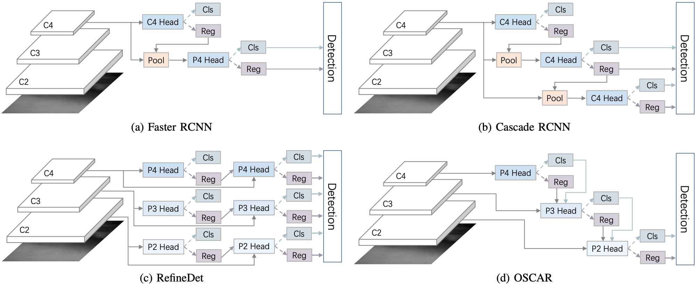
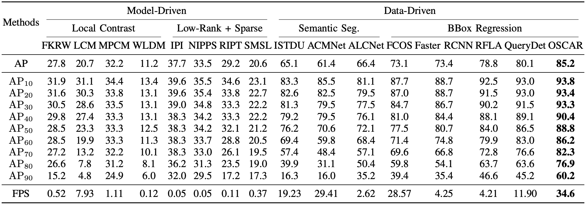
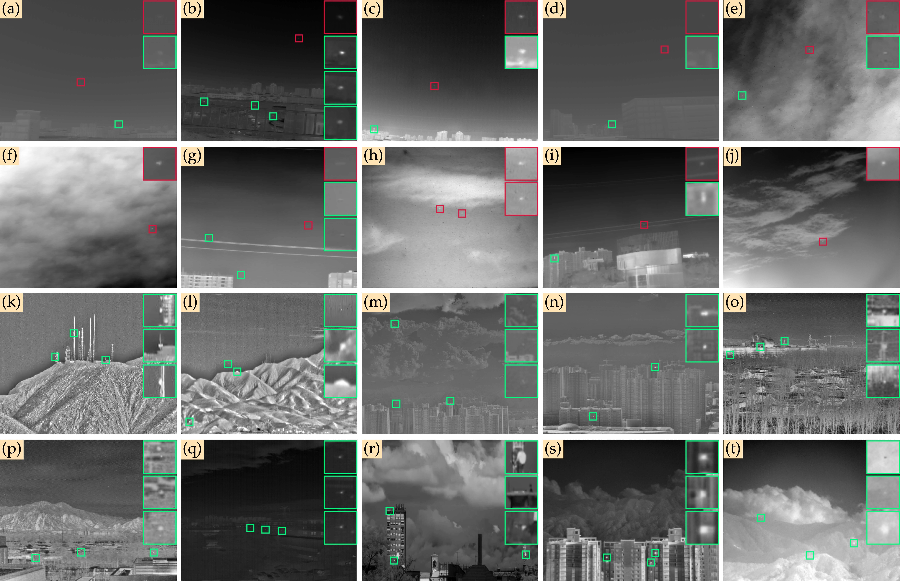

# DeepInfrared

<!-- **This page is under construction, not finished yet.** -->

DeepInfrared aims to be an open benchmark for infrared small target detection, currently consisting of:

1. Public infrared small target dataset (SIRST-V2);
2. Evaluation metrics specially designed (mNoCoAP);
3. An open source toolbox based on PyTorch (DeepInfrared).

## Introduction

Single-frame InfraRed Small Target (SIRST) detection has been a challenging task due to a lack of inherent characteristics, imprecise bounding box regression, a scarcity of real-world datasets, and sensitive localization evaluation. In this paper, we propose a comprehensive solution to these challenges. First, we find that the existing anchor-free label assignment method is prone to mislabeling small targets as background, leading to their omission by detectors. To overcome this issue, we propose an all-scale pseudo-box-based label assignment scheme that relaxes the constraints on scale and decouples the spatial assignment from the size of the ground-truth target. Second, motivated by the structured prior of feature pyramids, we introduce the one-stage cascade refinement network (OSCAR), which uses the high-level head as soft proposals for the low-level refinement head. This allows OSCAR to process the same target in a cascade coarse-to-fine manner. Finally, we present a new research benchmark for infrared small target detection, consisting of the SIRST-V2 dataset of real-world, high-resolution single-frame targets, the normalized contrast evaluation metric, and the DeepInfrared toolkit for detection. We conduct extensive ablation studies to evaluate the components of OSCAR and compare its performance to state-of-the-art model-driven and data-driven methods on the SIRST-V2 benchmark. Our results demonstrate that a top-down cascade refinement framework can improve the accuracy of infrared small target detection without sacrificing efficiency.



For details see [OSCAR](https://arxiv.org/abs/2212.08472). The speed and accuracy are listed as follows:



## SIRST-V2 Dataset

As a part of the DeepInfrared Eco-system, we provide the SIRST-V2 dataset as a benchmark.
SIRST-V2 is a dataset specially constructed for single-frame infrared small target detection, in which the images are selected from thousands of infrared sequences for different scenarios.

<!--  -->



Annotation formats available:

- bounding box;
- semantic segmentation;
- normalized contrast (produced when data loading).

The dataset can be downloaded [here](https://github.com/YimianDai/open-sirst-v2).

## The DeepInfrared Toolkit

### Installation

Please refer to [Installation](https://github.com/YimianDai/open-deepinfrared/blob/master/docs/INSTALL.md) for installation instructions.

### Getting Started

#### Train

```shell
# assume that you are under the root directory of this project,
# and you have activated your virtual environment if needed.
# and with SIRST-V2 dataset in 'data/sirst/'

python tools/train_det.py \
    configs/oscar/sota/oscar_w_noco_head_r18_caffe_fpn_p2_gn-head_1x_sirst_det2noco.py \
    --gpu-id 0 \
    --work-dir work_dirs/oscar_w_noco_head_r18_caffe_fpn_p2_gn-head_1x_sirst_det2noco

```

#### Inference

```shell
python tools/test_det.py \
    configs/oscar/sota/oscar_w_noco_head_r18_caffe_fpn_p2_gn-head_1x_sirst_det2noco.py \
    work_dirs/oscar_w_noco_head_r18_caffe_fpn_p2_gn-head_1x_sirst_det2noco/best.pth --eval "mNoCoAP"
```

### Overview of Benchmark and Model Zoo

For your convenience, we provide the following trained models.

Model | mNoCoAP | Config | Log | GFLOPS | Download
--- |:---:|:---:|:---:|:---:|:---:
faster_rcnn_r50_fpn_1x | 0.7141 | [config](https://raw.githubusercontent.com/YimianDai/deepinfrared-files/master/faster_rcnn_r50_fpn_1x_sirst_0_7141/faster_rcnn_r50_fpn_1x_sirst.py) | [log](https://raw.githubusercontent.com/YimianDai/deepinfrared-files/master/faster_rcnn_r50_fpn_1x_sirst_0_7141/20221201_041954.log) | | [baidu](https://pan.baidu.com/s/1fzgl2kJbcve4LC6tklGMYA?pwd=dv7b)
fcos_rfla_r50_kld_1x | 0.7882 | [config](https://raw.githubusercontent.com/YimianDai/deepinfrared-files/master/fcos_rfla_r50_kld_1x_0_7882/sirstv2_fcos_rfla_r50_kld_1x.py) | [log](https://raw.githubusercontent.com/YimianDai/deepinfrared-files/master/fcos_rfla_r50_kld_1x_0_7882/20221126_152729.log) | | [baidu](https://pan.baidu.com/s/1-JU-CA5a7FmEr0TRvXgh5Q?pwd=7gu6)
oscar_r18_fpn_p2_128_1x | 0.8352 | [config](https://raw.githubusercontent.com/YimianDai/deepinfrared-files/master/oscar_w_noco_head_r18_caffe_fpn_p2_128_gn-head_1x_sirst_det2noco_0_8352/oscar_w_noco_head_r18_caffe_fpn_p2_128_gn-head_1x_sirst_det2noco.py) | [log](https://raw.githubusercontent.com/YimianDai/deepinfrared-files/master/oscar_w_noco_head_r18_caffe_fpn_p2_128_gn-head_1x_sirst_det2noco_0_8352/20221203_034804.log) | 25.36 | [baidu](https://pan.baidu.com/s/1y5jQGZbPiPFm-FPvBydSCQ?pwd=rwyk)
oscar_r18_fpn_p2_256_1x | 0.8502 | [config](https://raw.githubusercontent.com/YimianDai/deepinfrared-files/master/oscar_w_noco_head_r18_caffe_fpn_p2_gn-head_1x_sirst_det2noco_0_8502/oscar_w_noco_head_r18_caffe_fpn_p2_gn-head_1x_sirst_det2noco.py) | [log](https://raw.githubusercontent.com/YimianDai/deepinfrared-files/master/oscar_w_noco_head_r18_caffe_fpn_p2_gn-head_1x_sirst_det2noco_0_8502/20221201_145722.log) | 68.32 | [baidu](https://pan.baidu.com/s/1JD5-6sb8Y-0tzOsGyzxebQ?pwd=pdj5)

For traditional methods, e.g., low-rank based or local contrast based approaches, we provide the predicted target images:

Method | mNoCoAP | Download
--- |:---:|:---:
LCM | 0.207 | [baidu](https://pan.baidu.com/s/1qUMPsy_J0ayneVZYDOkLcA?pwd=xhnn)
WLDM | 0.112 | [baidu](https://pan.baidu.com/s/1l8GvdxYerdAhBAVtT51vsA?pwd=nxn7)
FKRW | 0.278 | [baidu](https://pan.baidu.com/s/1rcdq9IJwMf6JbrfgM42nLQ?pwd=p9ap)
IPI | 0.377 | [baidu](https://pan.baidu.com/s/1N2grZro5Zrh4edXuxp5QDg?pwd=v31p)
MPCM | 0.322 | [baidu](https://pan.baidu.com/s/12L8GqgLYRjCsCkzJJLdxEw?pwd=x698)
NIPPS | 0.335 | [baidu](https://pan.baidu.com/s/1BGudl4V6mbQbefs0R5cYVA?pwd=kijt)
RIPT | 0.293 | [baidu](https://pan.baidu.com/s/1pDTtXKVk-HCcViPjc1YXgA?pwd=avp2)


## Acknowledgement

Thanks MMDetection team for the wonderful open source project!

## Citation

If you find DeepInfrared useful in your research, please consider citing this project.

```tex
@article{dai2022oscar,
  title={One-Stage Cascade Refinement Networks for Infrared Small Target Detection},
  author={Yimian Dai and Xiang Li and Fei Zhou and Yulei Qian and Yaohong Chen and Jian Yang},
  journal={arXiv preprint},
  year={2022}
}
```
